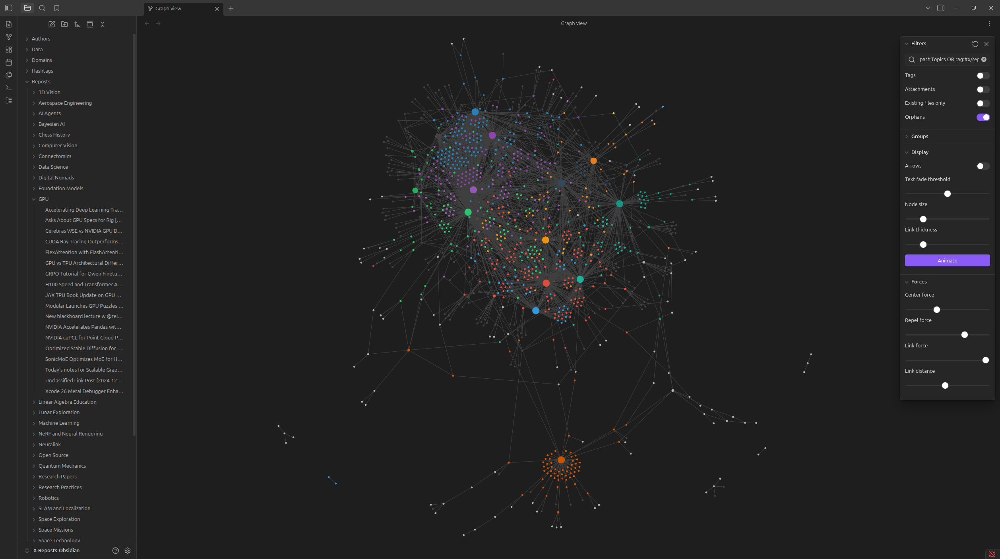

<div align="center">

# X Reposts → Obsidian Graph

<a href="https://obsidian.md"></a>
<a href="https://x.com"></a>
<a href="https://github.com/KopanevPavel/x-reposts-obsidian/tree/main/tests"></a>
<a href="https://github.com/KopanevPavel/x-reposts-obsidian/actions/workflows/tests.yml"></a>


</div>

This project fetches your own reposts from the X API v2 and turns them into an Obsidian vault with LLM-generated titles, topic assignments, topic summaries, and graph-friendly Markdown links.

It does **not** use the X archive download. It uses OAuth 2.0 Authorization Code with PKCE, calls `/2/users/me`, then paginates `/2/users/{id}/tweets`, detects reposts from `referenced_tweets.type == "retweeted"`, and writes Markdown notes connected by authors, topics, hashtags, and linked domains.

## Example

A full Obsidian graph generated from a real set of reposts — topic nodes share a color with their primary child reposts via cluster tags:

<p align="center">
  
</p>

## Roadmap / Future features

- [ ] Incremental vault updates: fetch only new reposts and update the existing Obsidian graph without full regeneration.
- [ ] Better LLM cache progress logging: show how many items are cache hits, cache misses, newly processed, retried, and failed.
- [ ] Resume-safe builds: continue from the last successful page/repost after API timeout, LLM failure, or interrupted run.
- [ ] Topic management tools: merge, rename, split, or pin topics so the graph stays clean after multiple runs.
- [ ] Cost and quota estimation: estimate X API reads before running and optionally stop at a user-defined budget/page limit.

## Version 0.3 changes

- Added `--llm-concurrency` for concurrent Ollama classification requests.
- Added `XRO_LLM_CONCURRENCY` environment variable.
- Made the LLM cache thread-safe for concurrent classification.
- Preserved deterministic note generation order while running LLM calls in parallel.

## Version 0.2 changes

- Local LLM support through Ollama.
- Default local model: `qwen3:32b`.
- LLM-generated topic per repost, with optional new topics when the configured list is not a good fit.
- LLM-generated short note titles and one-sentence summaries.
- Repost filenames now use: `LLM Title [time] [author].md`.
- Added a `GPU` topic.
- `Data/` is now populated with JSONL/JSON build artifacts.
- Topic notes now include LLM-generated major summaries over all assigned reposts.
- Graph cluster tags and `.obsidian/graph.json` are generated so each topic node and its primary child reposts can share a color.
- Graph Guide now includes filters for topic + repost visualization.

## Recommended local LLM setup

The default is Ollama + Qwen3 32B:

```bash
ollama pull qwen3:32b
ollama serve
```

On your laptop, if Ollama runs on a DGX Spark connected over Ethernet, set:

```bash
export OLLAMA_BASE_URL=http://DGX_SPARK_IP:11434
```

Or put it in `.env`:

```text
OLLAMA_BASE_URL=http://DGX_SPARK_IP:11434
XRO_LLM_MODEL=qwen3:32b
XRO_LLM_MODE=auto
XRO_LLM_CONCURRENCY=8
```

Test the LLM:

```bash
xro llm-test --ollama-base-url http://DGX_SPARK_IP:11434 --llm-model qwen3:32b
```

Use `--llm-mode required` if you want the build to fail when the LLM is unavailable:

```bash
xro build --vault X-Reposts-Obsidian --clear --llm-mode required --llm-concurrency 8
```

Use `--llm-mode off` for a fast keyword-only fallback:

```bash
xro build --vault X-Reposts-Obsidian --clear --llm-mode off
```


### Concurrent LLM classification

If Ollama is running with parallel request slots, for example `OLLAMA_NUM_PARALLEL=8`, use matching client concurrency:

```bash
xro build \
  --vault X-Reposts-Obsidian \
  --clear \
  --llm-mode required \
  --ollama-base-url http://DGX_SPARK_IP:11434 \
  --llm-model qwen3:32b \
  --llm-concurrency 8
```

`--llm-concurrency` sends multiple independent classification requests to Ollama at once. It does not micro-batch several reposts into one prompt. Topic summaries still run after classification. Start with `4` or `8`; increase only if wall-clock time improves.

## What it creates

```text
X-Reposts-Obsidian/
  Interest Summary.md
  Graph Guide.md
  Reposts/
    Robotics/
      Helpful Robot Foundation Model [2026-01-01 12-10] [@someauthor].md
    GPU/
      CUDA Kernel Optimization Notes [2026-01-02 09-30] [@someauthor].md
  Authors/
  Topics/
    Robotics.md
    GPU.md
  Domains/
  Hashtags/
  Data/
    README.md
    reposts.jsonl
    topic_assignments.jsonl
    topic_summaries.json
    topics.json
    manifest.json
    llm_cache.json
    coverage.json
  .obsidian/
    graph.json
```

Open the output folder as an Obsidian vault and use Graph View.

## Important API limits

X's user-posts timeline endpoint returns up to 100 posts per request and paginates with `pagination_token`. X documents the user-posts timeline retrieval cap as the 3,200 most recent posts. That means this project retrieves every repost the API can return from that timeline window, not necessarily every lifetime repost if your account has more than 3,200 posts/reposts combined.

Current X docs used for this project:

- OAuth 2.0 with PKCE: https://docs.x.com/fundamentals/authentication/oauth-2-0/authorization-code
- Get authenticated user: https://docs.x.com/x-api/users/get-my-user
- Get user posts: https://docs.x.com/x-api/users/get-posts
- Timeline pagination and 3,200-post cap: https://docs.x.com/x-api/posts/timelines/integrate

## Setup

### 1. Create an X Developer app

In the X Developer Portal:

1. Create or open a project/app.
2. Enable OAuth 2.0.
3. Set the app type to **Native App / Public client**.
4. Select **Read** permission only.
5. Add this callback URL exactly:

```text
http://127.0.0.1:8765/callback
```

6. Enable these scopes:

```text
tweet.read users.read offline.access
```

NOTE: the setup might look like this (as Website URL you can select e.g. your GitHub profile address) [image](misc/settings.png)

7. Copy the OAuth 2.0 Client ID.

### 2. Install locally

```bash
cd x-reposts-obsidian
python3 -m venv .venv
source .venv/bin/activate
pip install -e .
```

### 3. Configure credentials

```bash
cp .env.example .env
python3 setup_env.py
```

Edit `.env` for the LLM if Ollama is not on the same machine:

```text
OLLAMA_BASE_URL=http://DGX_SPARK_IP:11434
XRO_LLM_MODEL=qwen3:32b
XRO_LLM_MODE=auto
```

### 4. Authenticate

```bash
xro auth
```

A browser window opens. Approve the app. Tokens are saved to `.xro/tokens.json` by default. Keep this file private.

Check the auth:

```bash
xro status
```

### 5. Build the Obsidian vault

```bash
xro build --vault X-Reposts-Obsidian --clear
```

For a first smoke test:

```bash
xro build --vault X-Reposts-Obsidian --max-pages 2 --clear --llm-mode required
```

Then open `X-Reposts-Obsidian` as a vault in Obsidian.

## Useful commands

Fetch posts from a date range:

```bash
xro build \
  --vault X-Reposts-Obsidian \
  --start-time 2025-01-01T00:00:00Z \
  --end-time 2026-01-01T00:00:00Z \
  --clear
```

Export JSON Lines without Markdown:

```bash
xro export-json --out reposts.jsonl
```

Use custom topic rules:

```bash
xro build --topics config/topics.yaml --vault X-Reposts-Obsidian --clear
```

Force existing topics only:

```bash
xro build --vault X-Reposts-Obsidian --clear --no-new-topics
```

Keep an external LLM cache so `--clear` does not erase old LLM outputs:

```bash
xro build --vault X-Reposts-Obsidian --clear --llm-cache .xro/llm_cache.json
```

## How the graph is built

Each repost note links to:

- `[[Authors/@username]]`
- `[[Topics/Robotics]]`, `[[Topics/GPU]]`, etc.
- `[[Domains/arxiv.org]]`, `[[Domains/github.com]]`, etc.
- `[[Hashtags/topic]]`

Each topic note and every repost whose **primary topic** is that topic also share a cluster tag:

```text
#x/cluster/robotics
#x/cluster/gpu
#x/cluster/foundation-models
```

The generated `.obsidian/graph.json` uses those cluster tags for graph color groups. This is how the topic parent and its child reposts get the same color.

## Topic classification

The LLM receives:

- tweet text,
- author,
- hashtags,
- linked domains,
- X context labels,
- configured candidate topics.

It returns:

- title,
- short summary,
- primary topic,
- optional secondary topics,
- confidence,
- short rationale.

It should prefer configured topics but can create new reusable topics when none fit. `Unclassified` is still available for genuinely unclear posts.

## Topic summaries

For each primary topic, the project sends the assigned repost texts and LLM summaries back to the local LLM and writes a major synthesis into `Topics/<topic>.md`.

## Graph filters

Open `Graph Guide.md` in the generated vault. It includes examples such as:

```text
tag:#x/repost
```

```text
path:Topics OR tag:#x/repost
```

```text
tag:#x/cluster/robotics
```

```text
tag:#x/repost tag:#x/cluster/robotics
```

## Tests

Unit tests live in [`tests/`](https://github.com/KopanevPavel/x-reposts-obsidian/tree/main/tests) and cover utilities, topic classification, and concurrent LLM note generation.

Run them with `pytest` from the project root:

```bash
pip install pytest
pytest -v
```

## Security notes

- `.env` and `.xro/tokens.json` are ignored by Git.
- Do not commit OAuth tokens.
- Use the smallest scopes needed: `tweet.read users.read offline.access`.
- `offline.access` is used so the CLI can refresh the token without forcing a browser login each run.
- LLM calls go only to the `OLLAMA_BASE_URL` you configure.

## Troubleshooting

### Ollama cannot be reached

On the DGX Spark or local LLM machine:

```bash
ollama serve
ollama pull qwen3:32b
```

On your laptop:

```bash
xro llm-test --ollama-base-url http://DGX_SPARK_IP:11434 --llm-model qwen3:32b
```

### Callback mismatch

If X says the callback is invalid, make sure the callback URL in the Developer Portal is exactly:

```text
http://127.0.0.1:8765/callback
```

and `.env` has:

```text
X_REDIRECT_URI=http://127.0.0.1:8765/callback
```

### No reposts found

Run:

```bash
xro build --max-pages 5 --clear
```

If it still finds zero reposts, the timeline pages returned by your API tier may not include repost objects, or the account may not have reposts in the retrievable 3,200-post timeline window.

### Rate limits

By default the CLI sleeps until X's rate-limit reset time after HTTP 429. Disable that behavior with:

```bash
xro build --no-rate-limit-sleep
```

## LLM progress bars

`xro build` shows progress bars for the two slow LLM phases:

- `LLM classify` — one item per repost being classified/titled. With `--llm-concurrency N`, completions may arrive out of order, but note generation remains deterministic.
- `LLM topic summaries` — one item per topic summary generated from the assigned reposts.

Disable progress bars when running in logs/CI:

```bash
xro build --vault X-Reposts-Obsidian --llm-mode required --no-progress
```

## Network retries for X API timeouts

If X API calls occasionally time out, increase retry/timeout settings instead of restarting the whole run immediately:

```bash
xro build \
  --vault X-Reposts-Obsidian \
  --llm-mode required \
  --ollama-base-url http://DGX_SPARK_IP:11434 \
  --llm-model qwen3:32b \
  --llm-concurrency 8 \
  --api-timeout 60 \
  --api-max-retries 10 \
  --api-retry-backoff 3
```

Equivalent environment variables:

```bash
export XRO_REQUEST_TIMEOUT_SECONDS=60
export XRO_API_MAX_RETRIES=10
export XRO_API_RETRY_BACKOFF=3
```

Retryable failures include connection/read timeouts, transient connection errors, and HTTP 500/502/503/504. HTTP 429 rate limits are still handled separately by sleeping until the X reset window unless `--no-rate-limit-sleep` is used.

## Cost for X.com API usage

In my case, I paid less than $1 to retrieve 1000 of my reposts.